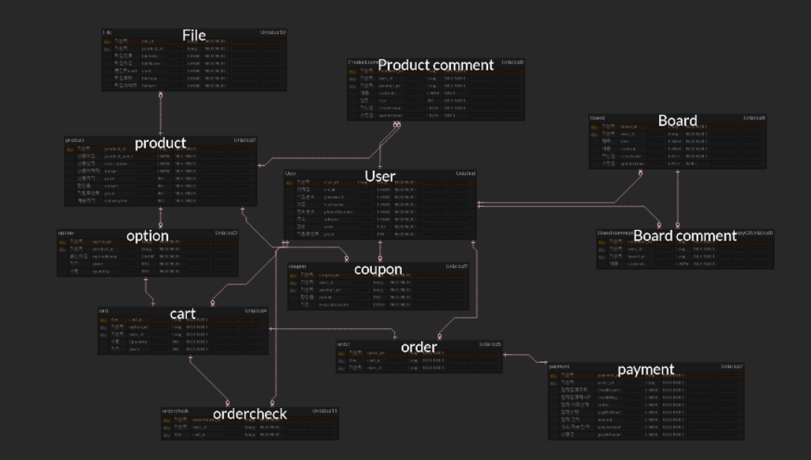

# (1) 12월 11일 브레인스토밍 및 회고

## 쇼핑몰 업종

 

**브랜드 가구 쇼핑몰**

## **엔티티를 구현한다면? (ERD)**

### **유저 user**

- `userId`,`userName`, `email`, `password`, `phoneNumber`, `address`, `point`, `roles`

 

### **상품 product (이벤트)**

- `productId`, `productName`, `price`, `image`, `onSale`, `description`, `deliveryFee`

 

### **옵션 options ( 옵션명에 색상, 사이즈를 담게 )**

- `optionId`, `optionName`, `productId`, `quantity`, `price`

 

### **장바구니 cart**

- `cartId`, `userId`, `optionId`, `price`, `quantity`

 

### **구매 order**

- `orderId`, `userId`, `cartId`

 

### 구매완료 orderFinish

- `orderFinishId`, `userId`, `cartId`

 

### **결제 payments (페이먼츠)**

- `paymentId`, `orderId`, `resultCode` , `resultMsg`, `status`, `payMethod`, `amount`, `balanceAmt`, `goodsName`

 

### **보드 board (**QNA, 공지사항)

- `boardId`, `userId`, `title`, `contents`, `createTime`, `updateTime`

 

### 보드 **코멘트 boardComments**

- `boardId`, `userId`, `title`, `contents`, `createTime`, `updateTime`

 

### 상품 **코멘트 productComments**

- `commentId`, `userId`, `productId`, `contents`, `star`, `createTime`, `updateTime`

 

### **쿠폰 coupon**

- `userId`, `productId`, `onSale`, `expirationDate`

 

### 파일 file

- `fileId`, `productId`, `filePath`, `fileName`, `uuid`, `fileType`, `fileSize`

 

## 오전 회고 이슈 해결

### 적립 포인트 해결

#### 쿠폰 해결

쿠폰 테이블 생성및 유저와의 연관매핑으로 해결

 

#### 별점 및 리뷰 일부 해결

`orderCheck`를 통해서 결제가 완료되었으면 리뷰 작성 가능

 

#### `OrderCheck` 이슈

order 와의 연관관계 매핑 대신 결제가 완료된 cart와 id의 정보를 받아옴으로 해결

 

#### 댓글 테이블 이슈

`productComment` , `boardComment` 테이블 두개로 나눔으로써 해결

 

#### 적립 포인트 기능 추가 이슈 일부 해결

회의끝에 `User` 테이블에 `point` 컬럼 추가하는것으로 해결

 

## 회고록

### ERD 이슈

#### 카테고리를 넣을것인가?

- Issue : 자기자신을 맵핑
  - 회의가 추가적으로 필요

 

### 카드등록은 어떻게 할 것인가?

- 보류

 

### 화면 구성은 어떻게 할 것인가?

 

## 익일 예정 스케줄

1. 1시간동안 서술한 이슈에 대한 추가 회의

2. 역할 배분

3. 코딩 작업

   