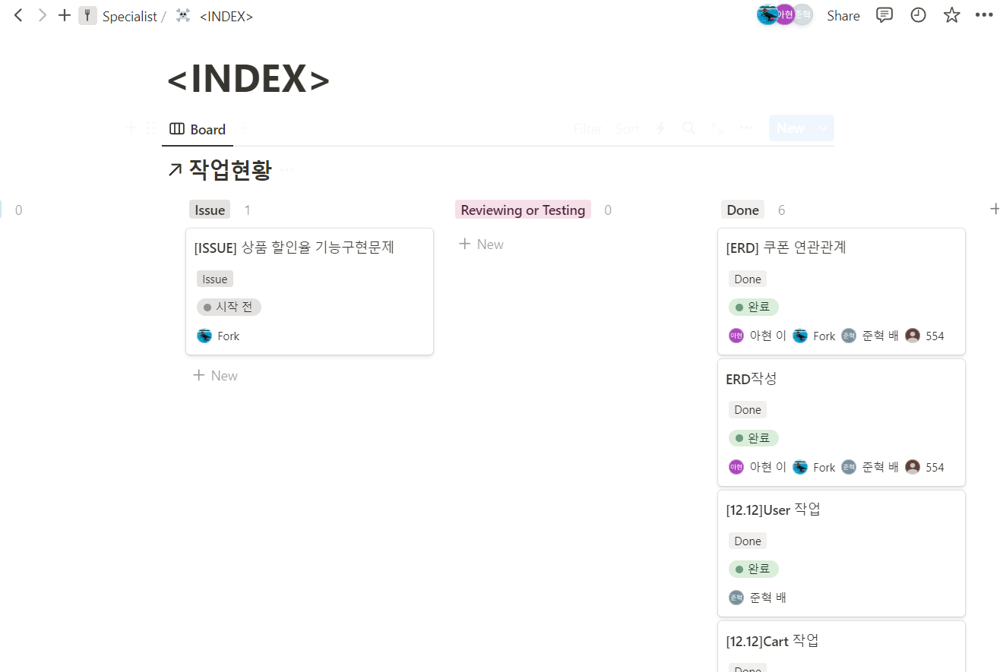

# (2) 12.12 스크럼 및 회고

# **12월 12일 회의**

## **작업 우선순위**

### **1순위**

1. `User` - 배준혁
2. `Product` - 송한올
3. `Cart` - 홍주형
4. `Option` - 이아현

------

> 다음 사이클 재 역할분담 예정  

  

 

## **사이클 (1)**

`User`, `Product`, `Cart`, `Option` 의 CRUD

**완료 기한 최대 3일**

## **전날 이슈 관리**

### **카테고리를 넣을것인가?**

- Issue : 자기자신을 맵핑
  - 회의가 추가적으로 필요

  

### **해결**

- 트리구조로 해결, 자식이 부모를 물고 물리는 관계
- 상품은 최하위의 카테고리만 가질 수 있음

  

### **화면 구성은 어떻게 할 것인가?**

- 단순한 기능 구현 테스트 버전으로 해결
- 추후 회의 필요

  

# **회고**

## 발생한 이슈

  

### 패키지명 오류 이슈
Spring Initilizr 사용시 패키지명 오작성으로 인한 이슈

GitHub의 서투른 사용으로 인하여 꼬여버리는 상황 발생

#### 해결

각 브런치의 오류패키지 삭제후 Merge

### `Product`의 할인율 기능 구현 이슈

상품 생성 및 수정시 할인율 구현의 방법 모색중

#### 해결
JavaScript에서 표현 가능하며 백엔드 작업은 `order`에서 구현