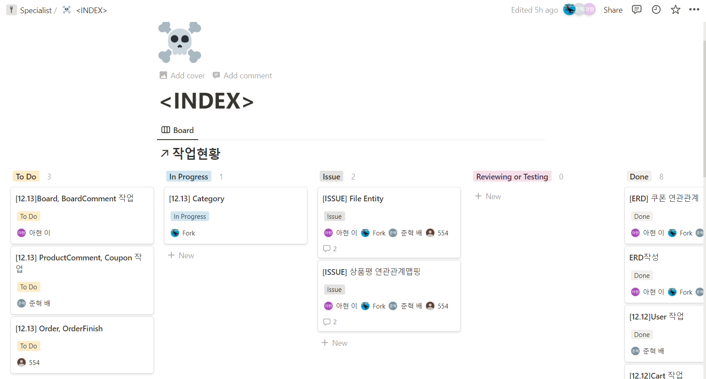

# (3) 12.13 스크럼 및 회고

## 스크럼

### 재역할 분담

`order`, `orderFinish` - 홍주형

`board`, `boardComment` - 이아현

`productComment`, `coupon` - 배준혁

`category`, `file` - 송한올

마감 기한 - 15일까지

---

#### 비고

15일 팀장의 부재로 인해 Pull Request의 Reviewer 이아현 으로 지정.

특별사항은 팀장(송한올)에게 문의

---

## 다음 사이클 미리보기

### 맡은 엔티티의 추가 기능 

`User` - 배준혁

- 회원 수정
- 회원 탈퇴
- 회원 정보 조회

### 공통 작업

`payments`

> 해당 엔티티는 다음 사이클 스크럼시 논의 예정;

  

# 회고

## **발생한 이슈**

### **상품평 연관매핑 이슈**

현재 `productComment`는 `user_id`와 `product_id`와 연결중

#### **솔루션**

- `ordercheck`과 `productComment` 만 연결

### **`File` 엔티티**

`Product`와 `Board`의 저장된는 경로도 같아지고 불필요한 연결중

#### **솔루션**

- fileProduct 와 boardFile 두가지로 나눠서 해결

### **쿠폰 배분 방식**

1. 조건 충족시 발급가능 ( 진행중 )
   - HTML에서 어떻게 작성하나?

2. 이벤트 쿠폰 ( 완료 )

#### 해결

`coupon` 이 후술할 이유로 삭제
 

### `ProductComment` 작성 이슈

- `orderCheck` 작업이 끝나야 작업 가능.

 

### `OrderCheck` 의 연관관계 매핑 이슈

- `cart` 가 아니라 `option` 을 받아와야 한다.

 

### 작업시간

현재 작업량에 비해 시간이 부족하여 일부 기능과 엔티티가 삭제된다.

#### 기능 제거

`coupon`, `boardComment`

할인율 기능, 적립포인트

- `category` → 배준혁 작업 이관

